# FX Checker - Foreign Exchange Currency Converter

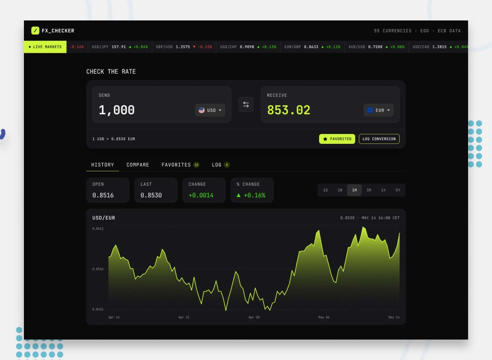

FX Checker started as my entry for [Frontend Mentor's FM30 Hackathon](https://www.frontendmentor.io/challenges/foreign-exchange-currency-converter). It didn't make the finalist round, but I kept building past the submission deadline anyway — the bigger goal for me was always learning and pushing past what I already knew how to build, not the competition result. It's grown a lot since: a currency-strength heatmap, full account settings, offline support, and more, on top of what was there for the original submission.

It's a full-stack currency converter pulling live rates from the European Central Bank via the Frankfurter API (free, no API key, no rate limits), presented through a converter, historical charts, a currency-strength heatmap, multi-currency comparison, pinned favorites, rate alerts, and a conversion log. Signed-in accounts sync favorites, logs, alerts, and recent pairs across devices via [Neon PostgreSQL](https://neon.tech/), with a full settings area for managing profile, preferences, interface, and linked logins.

**Live demo:** [https://fem-fx-checker-hackaton.vercel.app/](https://fem-fx-checker-hackaton.vercel.app/)

**Solution page:** [https://www.frontendmentor.io/solutions/fx-checker-full-stack-foreign-exchange-currency-converter](https://www.frontendmentor.io/solutions/fx-checker-full-stack-foreign-exchange-currency-converter-j_Nsyg0Emv)

**WakaTime (coding time):** [](https://wakatime.com/badge/user/018cb534-87bb-4814-975b-ca5e3cb8572b/project/3744af2b-53c9-404d-b9c4-ac6165f9e277)

**CI:** [](https://github.com/SouleymaneSy7/fem-fx-checker-hackaton/actions/workflows/ci.yml)

---

## Table of Contents

- [Tech Stack](#tech-stack)
- [Features](#features)
- [Screenshots](#screenshots)
- [Design System](#design-system)
- [Architecture](#architecture)
- [API Reference](#api-reference)
- [Security](#security)
- [Performance](#performance)
- [Lighthouse Scores](#lighthouse-scores)
- [Getting Started](#getting-started)
- [Folder Structure](#folder-structure)
- [Deployment](#deployment)
- [Known Limitations](#known-limitations)
- [Difficulties & Future Work](#difficulties--future-work)
- [Stretch Goals](#stretch-goals)
- [Author](#author)

---

## Tech Stack

| Layer              | Choice                                                   |
| ------------------ | -------------------------------------------------------- |
| Framework          | Next.js 16 (App Router) + React 19                       |
| React Compiler     | babel-plugin-react-compiler                              |
| Language           | TypeScript                                               |
| Styling            | Tailwind CSS v4                                          |
| UI primitives      | shadcn/ui (Radix-based)                                  |
| CSS helpers        | class-variance-authority, tailwind-merge, clsx           |
| State              | Zustand with `persist` middleware                        |
| Data fetching      | SWR — caching, deduplication, auto-revalidation          |
| HTTP client        | Axios                                                    |
| Forms              | react-hook-form + Zod resolvers                          |
| Database           | Drizzle ORM + Neon PostgreSQL                            |
| Auth               | better-auth — email/password, Google & GitHub OAuth      |
| Rate limiting      | Upstash Redis + @upstash/ratelimit                       |
| Charts             | Recharts                                                 |
| Animation          | Motion (formerly Framer Motion)                          |
| Validation         | Zod + drizzle-zod                                        |
| Icons              | Lucide React                                             |
| Utilities          | date-fns, sonner                                         |
| Linting            | Biome                                                    |
| CI                 | GitHub Actions — lint, typecheck, build on every push/PR |
| Font               | JetBrains Mono                                           |
| Runtime / packages | Bun                                                      |

---

## Features

### Converter

- Type an amount and see the converted value update instantly — the rate is already cached per pair, so there's no request to wait on
- Pick currencies from a searchable picker (flag, code, name) grouped into Popular and Other, with your most recent pairs shown first
- Swap send/receive currencies in one click
- Live rate displayed for the active pair (e.g. `1 USD = 0.8530 EUR`)
- Log a conversion, pin the active pair, or set a rate alert directly from the converter
- Bidirectional URL sync for shareable conversion links (`?from=USD&to=EUR&amount=100`)
- Recent pairs tracked automatically (MRU, max 8) and shown at the top of the picker

### Live Markets

- Scrolling ticker showing current rates and 24h change for a configurable set of pairs (quoted against EUR by default)
- Rate history chart for the active pair with range selector: 1D / 1W / 1M / 3M / 1Y / 5Y
- Open, last, absolute change, and percentage change shown per selected range

### Compare

- Convert a send amount into multiple currencies at once, side by side, or switch to a chart view of percentage change over time
- Pin or unpin any row directly from the table
- Top gainer/loser highlighted in the chart view
- Table and chart keep independent currency selections — the chart holds up to 10 at once

### Currency Strength Heatmap

- N×N grid showing how every tracked currency moved against every other one over the selected range (1D–5Y, same selector as History)
- Every pair is triangulated through EUR from just two rate snapshots, instead of fetching each pair directly
- Cell color scales to the biggest mover in the current grid rather than a fixed percentage, so a 1-day view and a 5-year view both use the full color range instead of one looking washed out
- An info popover explains how to read it: green means the row currency strengthened against the column currency, red means it weakened
- Currently a fixed set of 8 major currencies (USD, EUR, GBP, JPY, CHF, CAD, AUD, CNY) — not yet customizable from Settings

### Favorites

- Pinned pairs with live rates and 24h change
- Unpin directly from the list
- Persisted in `localStorage`, synced to the server when signed in

### Rate Alerts

- Set rate alerts with a target threshold and condition (above / below)
- A background watcher polls latest rates at an interval you set in Settings, and fires a toast (with an optional sound) when a threshold is crossed
- Reset a triggered alert to start watching again, or delete it

### Historical Rates

- Time Machine: pick any date (back to 1999) and see the rate for the active pair
- Compare historical rate vs current rate with absolute and percentage change
- Handles weekend/holiday rate snapping automatically

### Conversion Log

- Log a conversion with one tap (or the `L` shortcut) and it's stamped automatically: relative time, pair, send and receive amounts
- Delete individual entries or clear the full log
- Capped at 100 entries (FIFO)
- CSV export
- Persisted in `localStorage` with server sync when signed in

### Keyboard Shortcuts

| Shortcut               | Action                                        |
| ---------------------- | --------------------------------------------- |
| `Ctrl/Cmd + K`         | Focus the Send currency search                |
| `Ctrl/Cmd + Shift + K` | Focus the Receive currency search             |
| `/`                    | Jump to the Send amount field                 |
| `Ctrl/Cmd + S`         | Swap send and receive currencies              |
| `F`                    | Favorite the active pair                      |
| `L`                    | Log the active conversion                     |
| `A`                    | Open the rate alert popover                   |
| `S`                    | Share the active pair                         |
| `C`                    | Copy the current rate                         |
| `T`                    | Toggle light/dark theme                       |
| `V`                    | Toggle Compare table/chart view               |
| `N`                    | Add a currency to Compare                     |
| `E`                    | Export the log as CSV                         |
| `Alt + 1` – `Alt + 7`  | Jump to a tab                                 |
| `1` – `6`              | Change chart range (History and Heatmap tabs) |
| `?`                    | Open this shortcuts panel                     |

Bare-letter shortcuts (F, L, A, S, C, T, V, N, E, and the range/tab digits) stay off while you're typing in a field; the `Ctrl`/`Cmd` combos work anywhere.

### Share

- Native share API on supported devices (mobile)
- Clipboard fallback with toast confirmation on desktop

### Auth & Account Sync

- Sign in or sign up with email and password (Zod-validated forms), or continue with Google or GitHub
- A shared demo account lets visitors try the app without creating one
- Once signed in, favorites, logs, alerts, and recent pairs sync between `localStorage` and the server; signing out returns to local-only mode with no data loss

### Account Settings

Four tabs, collapsing into a dropdown on mobile like the main tab bar:

- **Profile.** Edit your name and upload an avatar (downscaled and compressed in the browser before it's saved). Email changes show a "Coming soon" badge for now — see [Difficulties & Future Work](#difficulties--future-work).
- **Preferences.** Bundles five sections on one tab: converter defaults (send/receive currencies, amount, landing tab), display precision and which currencies show in the ticker and Compare, the alert sound and refresh interval, active sessions (see every signed-in device and sign any of them out remotely), and linked accounts (connect or disconnect Google and GitHub, though you can't unlink your only remaining sign-in method).
- **Interface.** Theme (mirrors the header button), a motion override (System / Always / Never reduced motion, on top of your OS setting), and ticker visibility with a Slow / Normal / Fast scroll speed.
- **Danger Zone.** Permanently delete the account: type `DELETE` to confirm, plus your current password if the account has one. OAuth-only accounts skip the password step and are protected instead by a requirement that the sign-in session be less than 24 hours old.

Every change here is saved locally right away and synced to the server in the background (debounced, coalesced into one request), so switching tabs or navigating away mid-change doesn't lose it.

### Theme Toggle

- Dark theme (default) and light theme
- Toggle via the header button, preference persisted in `localStorage`
- FOUC prevented by an inline initialization script in the root layout

### Offline Support

- A service worker caches exchange-rate responses. If the network drops or the API errors, it serves the last-known data instead, flagged as stale, for up to 24 hours
- A dismissible banner appears while you're viewing stale data, and comes back if you go offline again after reconnecting

### Accessibility

- Fully responsive: mobile, tablet, desktop
- Keyboard-navigable throughout
- Visible focus and hover states on every interactive element (`focus-ring` utility)
- Empty states for favorites, log, comparison, heatmap, alerts, and chart errors. No silent blank panels.
- Respects `prefers-reduced-motion` by default, with a per-app override in Settings > Interface for anyone who wants something different than their OS-wide setting
- Screen reader text for the ticker marquee and theme toggle
- Splash screen with loading state until all initial data is ready

---

## Screenshots


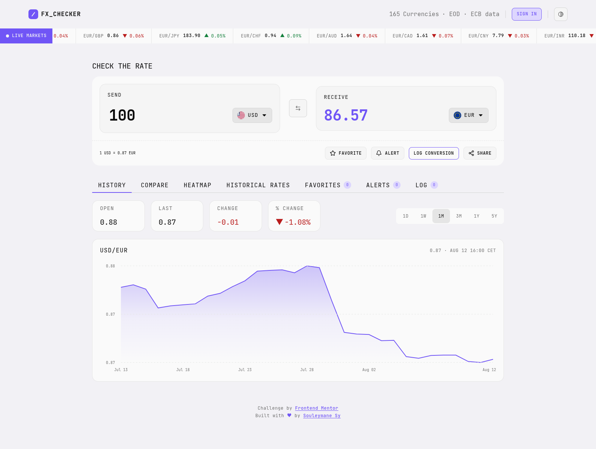
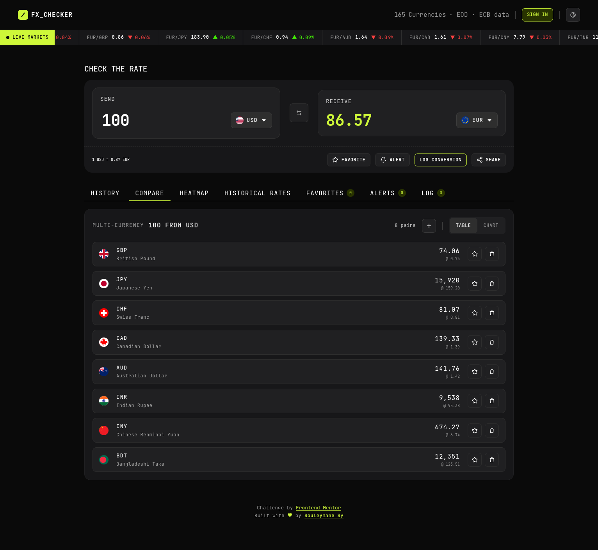

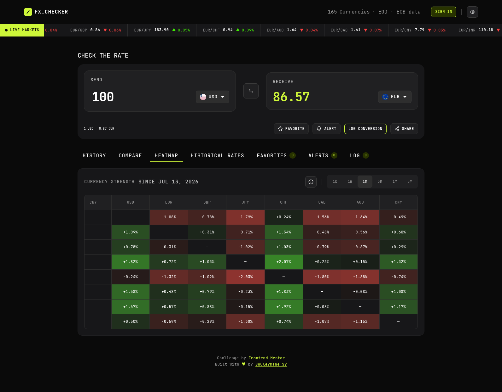
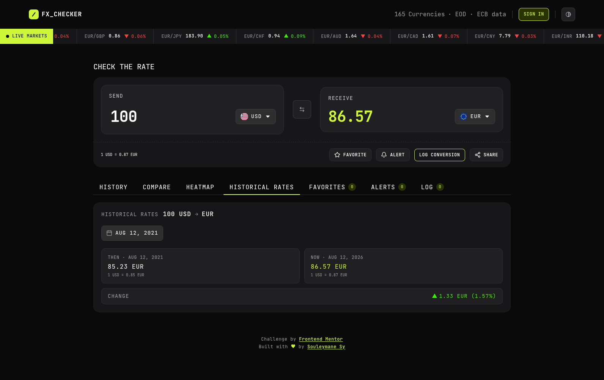

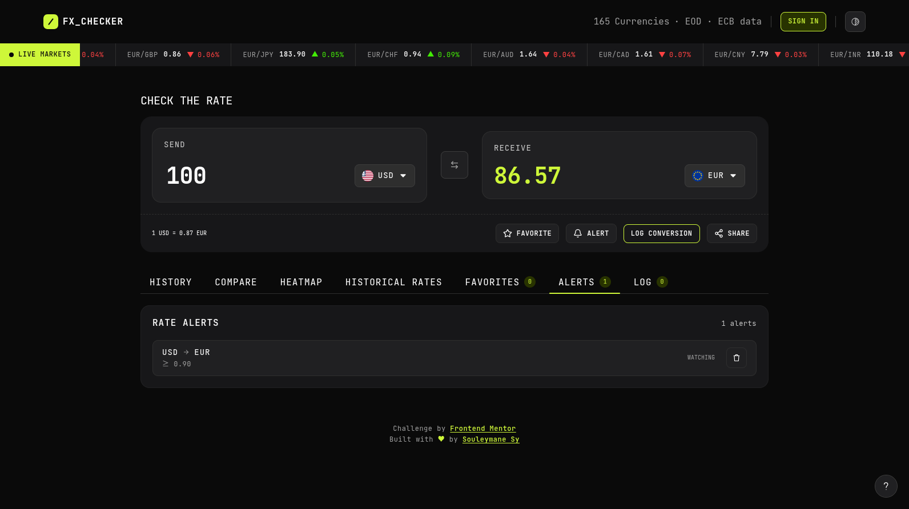
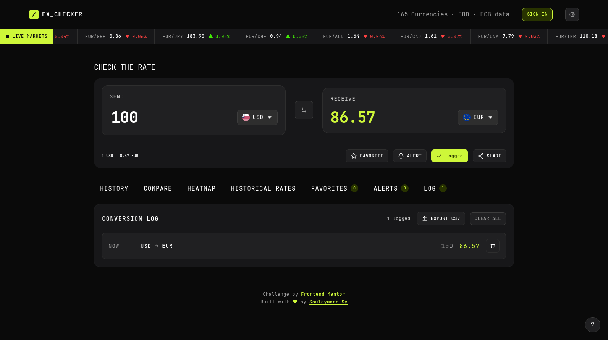
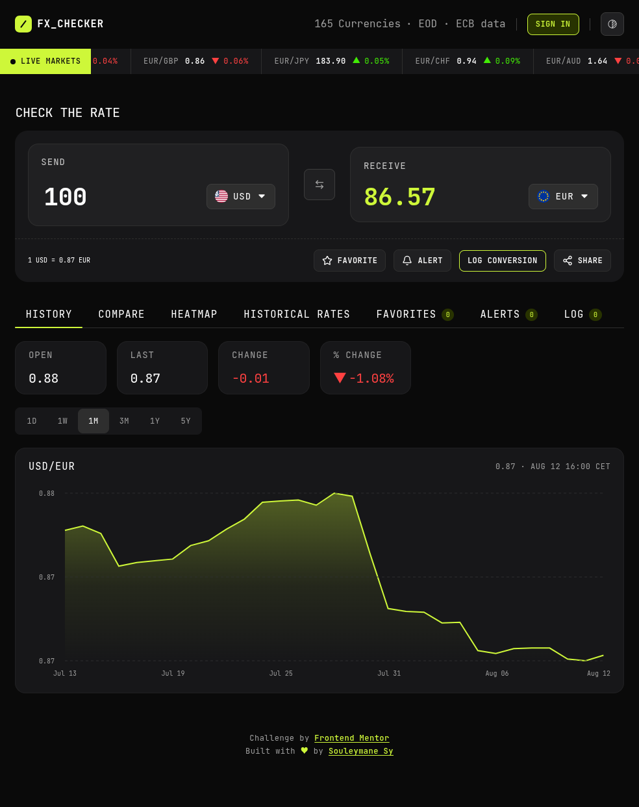

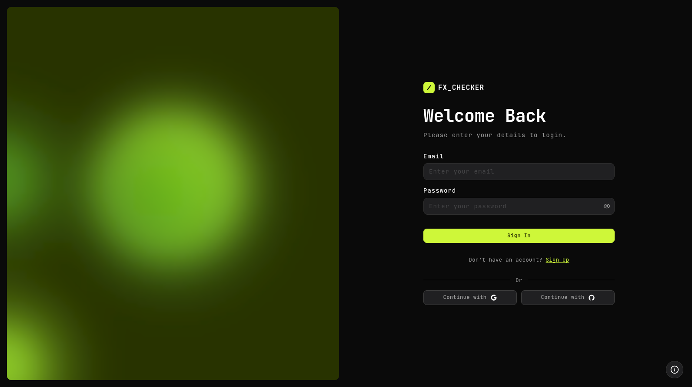
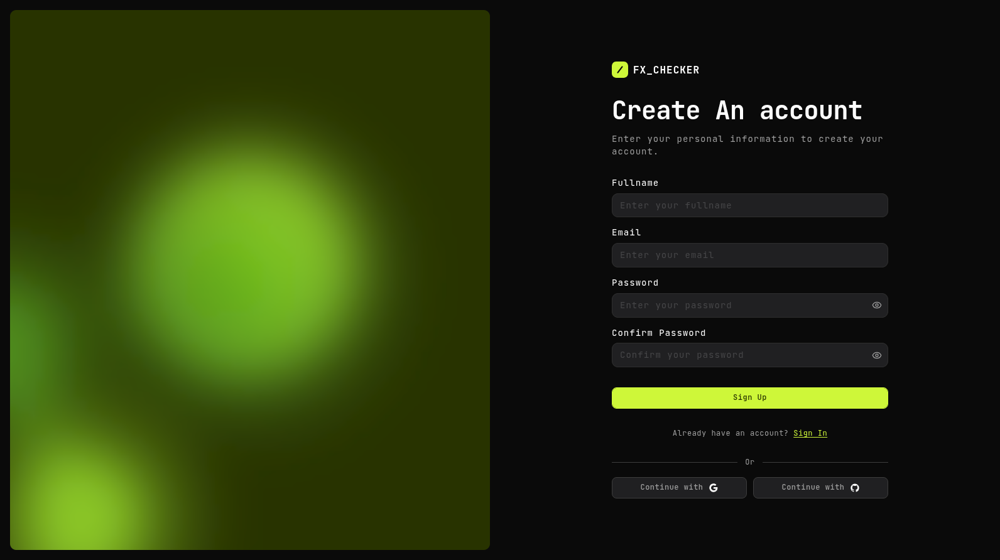
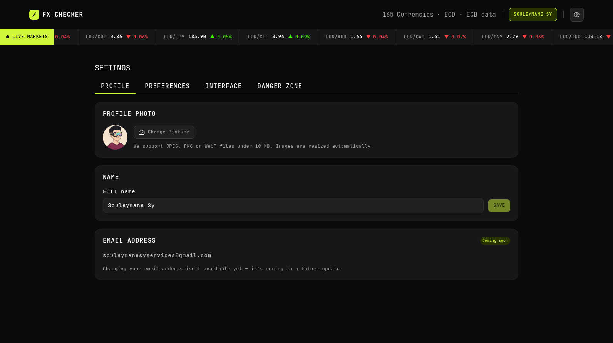
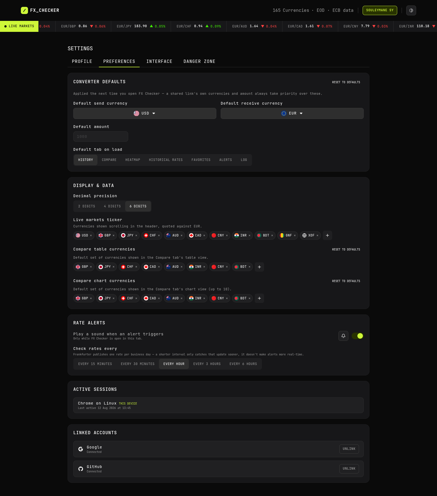
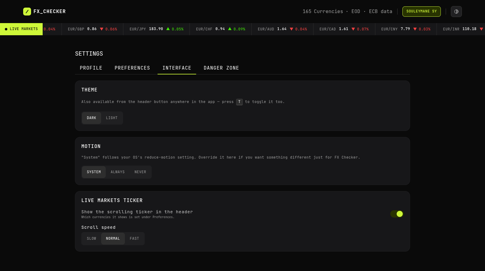
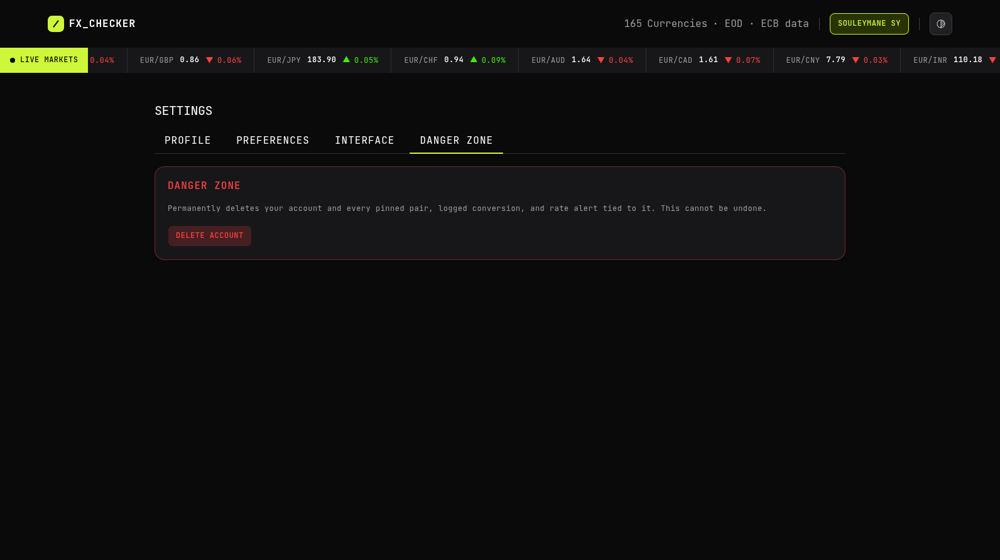

---

## Design System

Two themes (dark + light). One font. Semantic color tokens. Responsive sizing via `clamp()`. The token list below is the source of truth and lives in `tokens.css` and `shadcn.css`.

### Themes

| Theme | Default | Accent       | Background              | Toggle                   |
| ----- | ------- | ------------ | ----------------------- | ------------------------ |
| Dark  | Yes     | Lime (green) | `--neutral-900`         | Header button, persisted |
| Light | No      | Violet       | `--neutral-900` (light) | Header button, persisted |

Dark theme uses lime on near-black. Light theme uses violet on near-white. Both share the same neutral scale (inverted per theme), spacing, and typography. The active theme is applied via a `.dark` / `.light` class on `<html>`, synced by the `ThemeToggle` component and initialized inline to prevent FOUC.

### Colors

```css
:root {
  /* ── Neutrals (dark theme) ─────────────────────────────── */
  --neutral-900: oklch(0.1448 0 0); /* page background */
  --neutral-700: oklch(0.2055 0.0039 286.05);
  --neutral-600: oklch(0.2443 0.0038 286.12);
  --neutral-500: oklch(0.3012 0 0);
  --neutral-400: oklch(0.36 0 0);
  --neutral-300: oklch(0.3911 0.0033 286.24);
  --neutral-200: oklch(0.696 0 0);
  --neutral-100: oklch(0.8266 0 0);
  --neutral-50: oklch(1 0 0); /* primary text */

  /* ── Primary (dark theme) ──────────────────────────────── */
  --primary: oklch(0.9157 0.2054 121.64); /* lime — text, icons, rings */
  --primary-accent: oklch(
    0.3 0.0726 121.83
  ); /* dark lime — backgrounds, hover */

  /* ── Semantic ──────────────────────────────────────────── */
  --green: oklch(0.8217 0.267 140.6); /* positive change */
  --red: oklch(0.6607 0.2258 25.95); /* negative change */
}

.light {
  /* ── Neutrals (light theme — inverted scale) ──────────── */
  --neutral-900: oklch(0.96 0.0054 297.72); /* page background */
  --neutral-700: oklch(0.9851 0 0);
  --neutral-600: oklch(0.9702 0 0);
  --neutral-500: oklch(0.9219 0 0);
  --neutral-400: oklch(0.8699 0 0);
  --neutral-300: oklch(0.7155 0 0);
  --neutral-200: oklch(0.5555 0 0);
  --neutral-100: oklch(0.2686 0 0);
  --neutral-50: oklch(0.1448 0 0); /* now dark — primary text */

  /* ── Primary (light theme) ────────────────────────────── */
  --primary: oklch(0.5718 0.2285 284.18); /* violet */
  --primary-accent: oklch(0.8943 0.0549 293.28); /* light violet */

  /* ── Semantic ──────────────────────────────────────────── */
  --green: oklch(0.5273 0.1371 150.07);
  --red: oklch(0.5054 0.1905 27.52);
}
```

Design tokens are mapped to shadcn CSS variables (`--background`, `--card`, `--popover`, `--muted`, `--accent`, `--destructive`, `--border`, `--ring`, `--chart-1` to `--chart-5`, `--sidebar-*`) so shadcn/ui components respect both themes automatically.

### Typography

Single font: **JetBrains Mono** (weights: 400 / 500 / 700). Presets 1 and 3 use `clamp()` for responsive sizing.

| Preset        | Size                                          | Line height | Letter spacing | Weight  |
| ------------- | --------------------------------------------- | ----------- | -------------- | ------- |
| Preset 1      | `clamp(2rem, 1.8261rem + 0.8696vw, 2.5rem)`   | 100%        | -0.5px         | Bold    |
| Preset 2      | 20px                                          | 120%        | -0.5px         | Regular |
| Preset 2 Bold | 20px                                          | 140%        | -0.5px         | Bold    |
| Preset 3      | `clamp(0.875rem, 0.8315rem + 0.2174vw, 1rem)` | 120%        | 1px            | Regular |
| Preset 3 Med  | same as Preset 3                              | 120%        | 1px            | Medium  |
| Preset 3 Bold | same as Preset 3                              | 110%        | 1px            | Bold    |
| Preset 4      | 14px                                          | 120%        | 1px            | Regular |
| Preset 5      | 12px                                          | 120%        | 0.5px          | Regular |
| Preset 5 Med  | 12px                                          | 130%        | 0.5px          | Medium  |
| Preset 6      | 10px                                          | 100%        | 0px            | Regular |

Weight variants (Med / Bold) reuse their base preset's size, `clamp()` included — only the `font-weight` changes.

### Spacing

Base unit: 8px (`step-100`). Larger tokens use `clamp()` for responsive spacing. In Tailwind, use the `step-*` prefix: `p-step-200`, `gap-step-300`, `my-step-400`.

| Token    | Value                                            | Token     | Value                                        |
| -------- | ------------------------------------------------ | --------- | -------------------------------------------- |
| step-025 | 2px                                              | step-600  | `clamp(2.75rem, 2.663rem + 0.4348vw, 3rem)`  |
| step-050 | 4px                                              | step-800  | `clamp(3.5rem, 3.3261rem + 0.8696vw, 4rem)`  |
| step-075 | 6px                                              | step-1000 | `clamp(4.5rem, 4.3261rem + 0.8696vw, 5rem)`  |
| step-100 | 8px                                              | step-1200 | `clamp(5rem, 4.6522rem + 1.7391vw, 6rem)`    |
| step-125 | 10px                                             | step-1400 | `clamp(6rem, 5.6522rem + 1.7391vw, 7rem)`    |
| step-150 | 12px                                             | step-1600 | `clamp(7rem, 6.6522rem + 1.7391vw, 8rem)`    |
| step-200 | 16px                                             | step-1800 | `clamp(8rem, 7.7391rem + 1.3043vw, 8.75rem)` |
| step-250 | `clamp(1.125rem, 1.0815rem + 0.2174vw, 1.25rem)` |
| step-300 | `clamp(1.375rem, 1.3315rem + 0.2174vw, 1.5rem)`  |
| step-400 | `clamp(1.75rem, 1.663rem + 0.4348vw, 2rem)`      |
| step-500 | `clamp(2.25rem, 2.163rem + 0.4348vw, 2.5rem)`    |

### Containers

Three fixed-width breakpoints for consistent layout bounds:

| Token                 | Value    | Usage             |
| --------------------- | -------- | ----------------- |
| `--container-small`   | 68.75rem | Main content area |
| `--container-large`   | 90rem    | Header            |
| `--container-x-large` | 100rem   | Ticker            |

### Border Radius

| Token       | Value |
| ----------- | ----- |
| radius-0    | 0px   |
| radius-4    | 4px   |
| radius-6    | 6px   |
| radius-8    | 8px   |
| radius-10   | 10px  |
| radius-12   | 12px  |
| radius-16   | 16px  |
| radius-20   | 20px  |
| radius-24   | 24px  |
| radius-full | 999px |

### Chart Colors

Ten reusable line-series colors for the Compare tab's chart view, in separate dark and light variants. Colors are assigned by _position_ in the current selection, not by currency identity, so slot 1 might render GBP today and JPY tomorrow depending on what's picked.

| Token               | Dark                   | Light                  |
| ------------------- | ---------------------- | ---------------------- |
| `--chart-series-1`  | `oklch(0.68 0.18 250)` | `oklch(0.48 0.17 250)` |
| `--chart-series-2`  | `oklch(0.7 0.21 20)`   | `oklch(0.55 0.19 20)`  |
| `--chart-series-3`  | `oklch(0.72 0.19 320)` | `oklch(0.52 0.18 320)` |
| `--chart-series-4`  | `oklch(0.8 0.15 100)`  | `oklch(0.58 0.14 100)` |
| `--chart-series-5`  | `oklch(0.75 0.13 195)` | `oklch(0.55 0.13 195)` |
| `--chart-series-6`  | `oklch(0.78 0.17 45)`  | `oklch(0.6 0.16 45)`   |
| `--chart-series-7`  | `oklch(0.82 0.16 70)`  | `oklch(0.62 0.15 70)`  |
| `--chart-series-8`  | `oklch(0.78 0.15 145)` | `oklch(0.55 0.15 145)` |
| `--chart-series-9`  | `oklch(0.7 0.19 285)`  | `oklch(0.5 0.18 285)`  |
| `--chart-series-10` | `oklch(0.72 0.2 350)`  | `oklch(0.52 0.19 350)` |

---

## Architecture

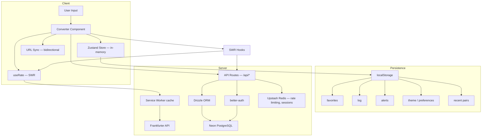

Data moves in three ways:

1. **Read path**: SWR hooks fetch from Frankfurter (rates) or `/api/*` (favorites, logs, alerts, recent pairs), cache results, and auto-revalidate. Components consume hooks directly.
2. **Write path**: user actions (pin, log, alert) apply to the Zustand store right away, then go through mutation hooks to `/api/*`, Drizzle, and Neon. A shared `runOptimisticMutation` utility rolls the local change back if the request fails. The same mutations also update `localStorage` for instant offline access. When signed in, `AccountSync` reconciles `localStorage` with the database.
3. **Offline resilience**: a service worker sits in front of the Frankfurter requests specifically, caching successful responses so it can replay them (flagged as stale) if the network or the API fails, for up to 24 hours.

---

## API Reference

### External — Frankfurter

All exchange rates come from [Frankfurter](https://frankfurter.dev/), a free, CORS-enabled API with no API key required. Rates are blended across 84 central banks for 201 currencies.

| Endpoint                                         | Used for                |
| ------------------------------------------------ | ----------------------- |
| `GET /currencies`                                | Currency picker list    |
| `GET /rate/{base}/{quote}`                       | Converter (single pair) |
| `GET /rates?base=USD&quotes=EUR,GBP`             | Ticker, comparison      |
| `GET /rates?base=USD&quotes=EUR&from=...&to=...` | Rate history chart      |

There's no separate "latest" or date-range path. One `/rates` endpoint covers the latest rate, a specific date (`date=`), and a time series (`from`/`to`), differentiated by query params. `quotes` is the equivalent of what other FX APIs call `symbols`.

The base URL (already includes `/v2`) is set via environment variable:

```
NEXT_PUBLIC_EXCHANGE_API_BASE=https://api.frankfurter.dev/v2
```

### Internal — Application API

| Route               | Methods                 | Purpose                                                                             |
| ------------------- | ----------------------- | ----------------------------------------------------------------------------------- |
| `/api/favorites`    | `GET`, `POST`, `DELETE` | CRUD for pinned currency pairs                                                      |
| `/api/logs`         | `GET`, `POST`, `DELETE` | CRUD for conversion log entries (bulk clear or per-pair delete)                     |
| `/api/logs/[id]`    | `DELETE`                | Delete a single log entry                                                           |
| `/api/alerts`       | `GET`, `POST`           | List and create rate alerts                                                         |
| `/api/alerts/[id]`  | `PATCH`, `DELETE`       | Reset/trigger or delete a single rate alert                                         |
| `/api/recent-pairs` | `GET`, `POST`, `DELETE` | CRUD for recently-used pairs (MRU)                                                  |
| `/api/settings`     | `GET`, `PATCH`          | Read or upsert the signed-in user's synced settings (preferences, theme, interface) |
| `/api/auth/*`       | `POST`, `GET`           | better-auth — sign-in, sign-up, OAuth callbacks, sessions, account linking/deletion |

All write endpoints are rate-limited via Upstash Redis.

---

## Security

- Every write endpoint (`/api/favorites`, `/api/logs`, `/api/alerts`, `/api/recent-pairs`, `/api/settings`) is rate-limited via Upstash Redis.
- Zod schemas validate every API request body and form input. Types are inferred directly from schemas, so there's no manual duplication.
- better-auth handles session management, backed by Redis as secondary storage for fast lookups. Favorites, logs, alerts, and recent pairs are scoped to the authenticated user via foreign keys.
- Account deletion requires typing a `DELETE` confirmation plus a fresh password for email/password accounts. OAuth-only accounts have no password to check, so they're protected instead by Better Auth's `session.freshAge` gate — deletion is rejected outright if the session is more than 24 hours old, until the person signs in again. The shared demo account is blocked from deletion, enforced server-side as well as in the UI.
- `.env.local` is gitignored. The `env.example` template contains placeholders only. No secrets are committed.
- Frankfurter API is CORS-enabled. Internal API routes run on the same origin.

---

## Performance

- React Compiler is enabled via `babel-plugin-react-compiler` in `next.config.ts`, which handles memoization automatically.
- SWR caches rates for 5 minutes, currencies for 1 hour, and flags for 1 day. Deduplication prevents redundant fetches across components.
- Changing the amount never triggers a new request — the rate for a pair is fetched once and cached, and the converted value is just a local `amount * rate` recomputed on the fly.
- The compare chart fetches data only when the user switches to the chart tab (via an `enabled` flag).
- Favorites, log, alert, and recent-pair mutations update the UI immediately and roll back automatically if the server call fails, through a shared `runOptimisticMutation` utility — no waiting on a round trip to see the result of a click.
- A service worker caches exchange-rate responses and serves the last-known data if the network or the API fails, so a dropped connection doesn't blank the converter.
- `clamp()` in spacing and font-size tokens means fewer breakpoints and less CSS.
- `useAppReadiness` tracks all initial SWR requests and dismisses the splash only when data is loaded, preventing layout shift.

---

## Lighthouse Scores

Measured on **August 12, 2026** via [PageSpeed Insights (Lighthouse)](https://pagespeed.web.dev/analysis/https-fem-fx-checker-hackaton-vercel-app/vvmw9y595o?hl=fr&form_factor=desktop).

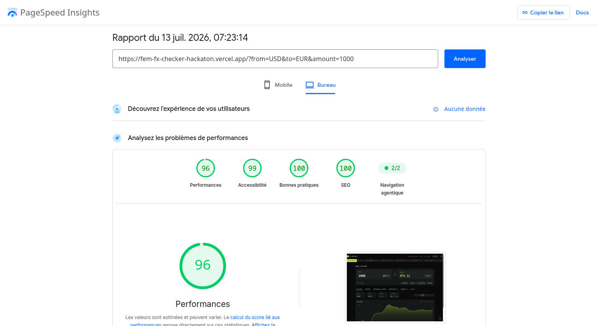

| Category       | Mobile | Desktop |
| -------------- | ------ | ------- |
| Performance    | 76     | 90      |
| Accessibility  | 100    | 100     |
| Best Practices | 100    | 100     |
| SEO            | 100    | 100     |

**Core Web Vitals (mobile):**

| Metric                         | Value  |
| ------------------------------ | ------ |
| First Contentful Paint (FCP)   | 0.9 s  |
| Largest Contentful Paint (LCP) | 5.6 s  |
| Total Blocking Time (TBT)      | 170 ms |
| Cumulative Layout Shift (CLS)  | 0.001  |
| Speed Index (SI)               | 3.5 s  |

Accessibility is a clean 100/100 on both — the heading-order issue that used to cost a couple of points (`SEND` rendered as an `<h3>` with no preceding `<h2>`) is fixed. Best Practices and SEO are perfect too, so nothing's regressed there.

Performance sits at 76 mobile / 90 desktop, and LCP is the main drag at 5.6s on mobile. I haven't profiled exactly which chunk is responsible, but the timing tracks with everything shipped since the original submission — the heatmap, the four-tab settings area, and the interface panel all add client-side JavaScript that has to hydrate before the page is fully interactive. Worth revisiting once there's time to trace it properly.

---

## Getting Started

### Prerequisites

- [Bun](https://bun.sh/) (or npm / yarn / pnpm)
- A [Neon](https://neon.tech/) PostgreSQL database (free tier works)
- An [Upstash](https://upstash.com/) Redis instance (free tier works)
- A [GitHub OAuth App](https://github.com/settings/developers), for GitHub sign-in
- A [Google Cloud OAuth 2.0 Client](https://console.cloud.google.com/apis/credentials), for Google sign-in

### 1. Clone and install

```bash
git clone https://github.com/SouleymaneSy7/fem-fx-checker-hackaton.git
cd fem-fx-checker-hackaton

bun install
```

### 2. Environment variables

Copy the example and fill in your values:

```bash
cp env.example .env.local
```

| Variable                        | Required | Description                                 |
| ------------------------------- | -------- | ------------------------------------------- |
| `NEXT_PUBLIC_EXCHANGE_API_BASE` | Yes      | Frankfurter API base URL                    |
| `DATABASE_URL`                  | Yes      | Neon PostgreSQL connection string           |
| `BETTER_AUTH_SECRET`            | Yes      | Auth secret (min 32 chars)                  |
| `BETTER_AUTH_URL`               | Yes      | App base URL (e.g. `http://localhost:3000`) |
| `UPSTASH_REDIS_REST_URL`        | Yes      | Upstash Redis REST URL                      |
| `UPSTASH_REDIS_REST_TOKEN`      | Yes      | Upstash Redis REST token                    |
| `GITHUB_CLIENT_ID`              | Yes      | GitHub OAuth App client ID                  |
| `GITHUB_CLIENT_SECRET`          | Yes      | GitHub OAuth App client secret              |
| `GOOGLE_CLIENT_ID`              | Yes      | Google OAuth 2.0 client ID                  |
| `GOOGLE_CLIENT_SECRET`          | Yes      | Google OAuth 2.0 client secret              |

The app validates its environment at startup, so all of these are required — it won't boot without them (see `env.ts`).

### 3. Database setup

```bash
bun run db:generate    # generate Drizzle migration
bun run db:push        # push schema to Neon
bun run db:studio      # optional — open Drizzle Studio
```

### 4. Run the dev server

```bash
bun dev
```

Open [http://localhost:3000](http://localhost:3000).

### 5. Lint and format

```bash
bun run lint      # biome check
bun run format    # biome format --write
```

---

## Folder Structure

```
src/
├── app/                          # Next.js App Router
│   ├── (auth)/                   # Route group — sign-in / sign-up pages
│   ├── (main)/                   # Route group — main layout, home page, settings page
│   ├── api/                      # Server-side API routes
│   │   ├── alerts/               #   Rate alerts CRUD
│   │   ├── auth/                 #   better-auth endpoints
│   │   ├── favorites/            #   Pinned pairs CRUD
│   │   ├── logs/                 #   Conversion log CRUD
│   │   ├── recent-pairs/         #   Recently-used pairs CRUD
│   │   └── settings/             #   Read/upsert synced settings
│   └── layout.tsx                # Root layout (metadata, providers, theme init)
│
├── components/
│   ├── common/                   # Generic reusable components (Container, Title, etc.)
│   ├── features/                 # Components organized by business feature
│   │   ├── alerts/               #   Rate alerts panel + watcher
│   │   ├── auth/                 #   Sign-in / sign-up forms, account sync
│   │   ├── compare/               #   Multi-currency comparison + chart
│   │   ├── converter/             #   Core converter UI + URL sync
│   │   ├── favorites/             #   Pinned pairs panel
│   │   ├── heatmap/                #   Currency strength grid + hint popover
│   │   ├── historical-rates/      #   Time Machine — date picker + comparison
│   │   ├── log/                   #   Conversion history
│   │   ├── markets/               #   Ticker, rate chart, range selector
│   │   ├── settings/              #   Profile, preferences (+ sessions/linked accounts), interface, danger zone
│   │   └── ticker/                #   Scrolling market ticker
│   ├── icons/                    # Custom SVG icon components
│   ├── layout/                   # Header, Footer, Navbar, TabNav, ThemeToggle
│   ├── loaders/                  # Splash screen, LiquidWave, SpinnerEllipsis
│   ├── providers/                # SWRProvider
│   ├── shared/                   # Components reused across features (CurrencyPicker, etc.)
│   └── ui/                       # shadcn/ui primitives (Button, Tabs, Tooltip, etc.)
│
├── constants/                    # App-wide constants (API, ranges, timing, shortcuts, etc.)
├── db/                           # Database layer
│   ├── index.ts                  #   Drizzle client
│   ├── schema.ts                 #   Combined schema barrel
│   ├── migrations/               #   Auto-generated SQL migrations
│   └── schemas/                  #   Per-feature schema definitions
├── hooks/                        # Custom React hooks (32 hooks)
├── lib/                          # Auth (server + client), rate limiting, Redis
├── services/                     # API layer — Frankfurter + internal routes
├── store/                        # Zustand stores (converter, favorites, log, alerts, preferences, theme, recent pairs, offline)
├── style/                        # CSS architecture
│   ├── globals.css               #   Entry point — imports all CSS
│   ├── tokens.css                #   Design tokens (colors, spacing, typography)
│   ├── shadcn.css                #   shadcn semantic variable mapping
│   ├── tailwind-config.css       #   Tailwind v4 @theme configuration
│   └── utilities.css             #   Custom utilities and animations
├── types/                        # Centralized TypeScript declarations
├── utils/                        # Pure utilities (formatting, export, storage, etc.)
└── validators/                   # Zod schemas for API + form validation
```

---

## Deployment

Deployed on [Vercel](https://vercel.com/). The Next.js config is picked up without extra setup.

**Production environment variables:**

| Variable                                    | Notes                                                                   |
| ------------------------------------------- | ----------------------------------------------------------------------- |
| `NEXT_PUBLIC_EXCHANGE_API_BASE`             | `https://api.frankfurter.dev/v2`                                        |
| `DATABASE_URL`                              | Neon PostgreSQL connection string (pooler recommended)                  |
| `BETTER_AUTH_SECRET`                        | Generate a new secret for production                                    |
| `BETTER_AUTH_URL`                           | Your production URL (e.g. `https://fem-fx-checker-hackaton.vercel.app`) |
| `UPSTASH_REDIS_REST_URL`                    | Upstash Redis REST URL                                                  |
| `UPSTASH_REDIS_REST_TOKEN`                  | Upstash Redis REST token                                                |
| `GITHUB_CLIENT_ID` / `GITHUB_CLIENT_SECRET` | Callback URL: `{BETTER_AUTH_URL}/api/auth/callback/github`              |
| `GOOGLE_CLIENT_ID` / `GOOGLE_CLIENT_SECRET` | Callback URL: `{BETTER_AUTH_URL}/api/auth/callback/google`              |

---

## Known Limitations

**No intraday data from Frankfurter.** Most providers behind the API publish rates once per business day. The 1D chart range shows a single data point, not an intraday curve. Every other range (1W and above) works fine. A paid API with tick data would fix this, but it's not worth the cost for a project like this one.

**No test suite.** Zero unit or integration tests right now. CI (GitHub Actions) catches lint, type, and build errors on every push, but that's not a substitute for actual test coverage of edge cases and regressions.

**Email address changes aren't available yet.** Settings > Profile shows the current email with a "Coming soon" badge. The app doesn't send any transactional email at all right now — see [Difficulties & Future Work](#difficulties--future-work) for why.

**The demo account is shared, not sandboxed.** Its pinned pairs, log, and alerts are one pool that every visitor using the published test credentials shares and can change. Its email and password are locked down, but nothing else about it is isolated per visitor.

---

## Difficulties & Future Work

### What was challenging

- **Intraday data limitation**: The Frankfurter API publishes rates once per business day. The 1D chart only gets a single data point, so I had to design around that with loading states and clear messaging instead of building a real intraday curve.
- **Bidirectional URL sync**: Keeping the converter state in sync with URL search params, and handling collisions when `from === to`, took more iteration than expected. The `converter-url-sync` hook had to be SSR-safe and debounce writes to avoid navigation thrash.
- **Full-stack state reconciliation**: Merging localStorage (instant, offline) with server state (persistent, shared) introduced edge cases around ordering, conflict resolution, and what happens when the user signs in mid-session.
- **Theme FOUC**: Preventing a flash of unstyled content on first paint required an inline `<script>` in the root layout that runs before React hydrates. The `ThemeToggle` component then takes over post-mount.
- **Rate alert polling**: Running a background polling loop for alerts without blocking renders or leaking intervals meant careful cleanup in the `AlertsWatcher` component.
- **A deletion flow that silently failed for real users**: the original design emailed a confirmation link to OAuth-only accounts before letting them delete (there's no password to re-confirm with). It worked fine locally, but without a verified Resend sending domain, Resend's sandbox only delivers to the account's own address, so the email never reached anyone else, and the failed send aborted the whole `deleteUser()` call. Rather than work around a third-party sandbox limit, I removed the email step entirely: deletion now falls back to Better Auth's built-in `session.freshAge` check (24 hours) instead. Email changes hit the same wall and got the same treatment: pulled out entirely, replaced by a "Coming soon" badge until there's a verified domain to send from.

### What I'd like to work on next

- **Testing**: Vitest for unit tests (hooks, utils, validators) and Playwright for E2E flows (converter, auth, alerts). This is the biggest gap in the project.
- **Email changes**: bring the feature back once a verified sending domain is available, so the confirmation code actually reaches people.
- **Customizable heatmap currencies**: the grid is a fixed set of 8 for now; a currency picker like Compare's is the natural next step.
- **End-to-end type safety**: Explore tRPC or similar to stop manually aligning types between API routes and client hooks.
- **Isolated demo data**: Give each demo visitor their own scoped, reset-on-schedule data instead of one pool shared by everyone using the published credentials.
- **Profile the LCP regression**: Performance dipped as features piled on ([see Lighthouse Scores](#lighthouse-scores)) — find out which chunk is actually costing the most and split or defer it.

---

## Stretch Goals

Shipped:

- [x] Light theme toggle
- [x] URL persistence for shareable conversions (`?from=USD&to=EUR&amount=100`)
- [x] Keyboard shortcuts (16 in total — see [Keyboard Shortcuts](#keyboard-shortcuts))
- [x] CSV export of the conversion log
- [x] Rate alerts with background polling and toast notifications
- [x] Historical rates ("Time Machine" date picker, back to 1999)
- [x] User accounts with favorites/logs/alerts/recent pairs sync across devices
- [x] Full account settings — profile, preferences (incl. sessions & linked accounts), interface, danger zone
- [x] Google and GitHub OAuth, alongside email/password
- [x] Offline fallback (service worker + stale-data banner)
- [x] Optimistic UI updates with automatic rollback
- [x] Currency strength heatmap with range-adaptive coloring
- [x] CI pipeline (lint, typecheck, build) on every push and PR
- [x] Share button (native share API + clipboard fallback)
- [x] Animated splash screen (LiquidWave spinner + text morph)
- [x] Tooltip system with smart truncation detection
- [x] Confirmation dialogs with Motion animations
- [x] `prefers-reduced-motion` support, with a per-app override in Settings > Interface
- [x] Interactive compare chart legend (toggle individual currency lines)
- [x] Tab badges with live counts
- [x] Responsive tab dropdown on mobile
- [x] SEO / OpenGraph metadata

Not yet:

- [ ] Customizable heatmap currency selection (fixed set of 8 for now)

---

## Author

_**Souleymane Sy**_

- **Portfolio**: [terminal-portfolio-website](https://terminal-portfolio-website-xi.vercel.app/)
- **GitHub**: [@SouleymaneSy7](https://github.com/SouleymaneSy7)
- **Frontend Mentor**: [@SouleymaneSy7](https://www.frontendmentor.io/profile/SouleymaneSy7)
- **LinkedIn**: [souleymanesy7](https://linkedin.com/in/souleymanesy7)
- **Twitter / X**: [@SouleymaneSy43](https://twitter.com/Souleymanesy43)
