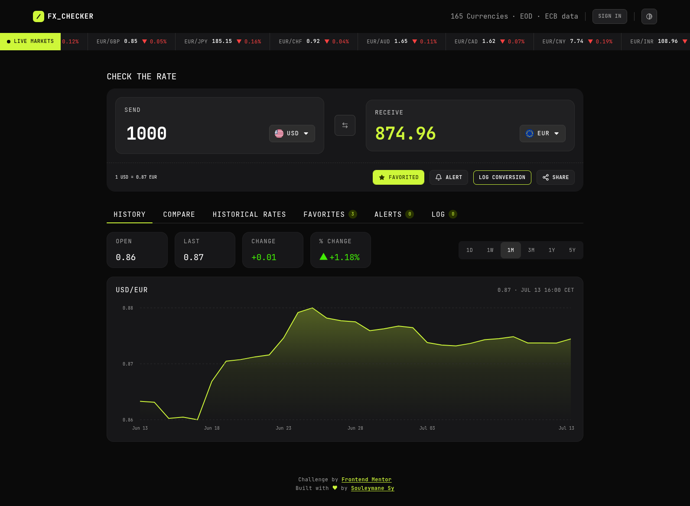
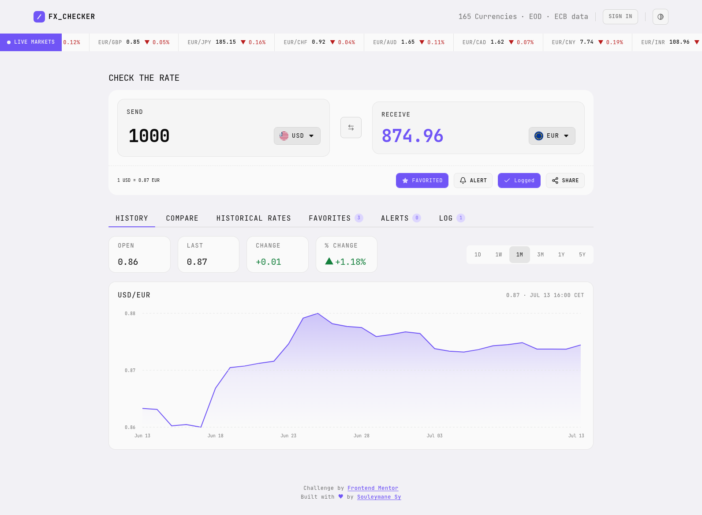
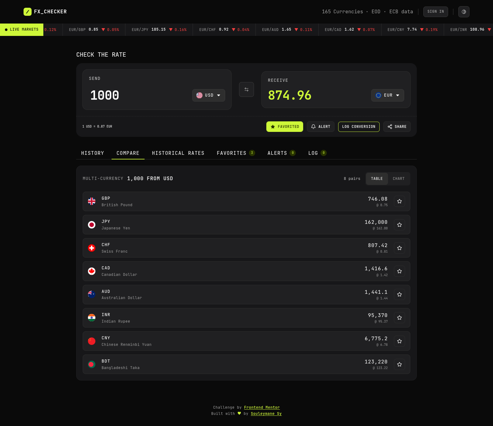
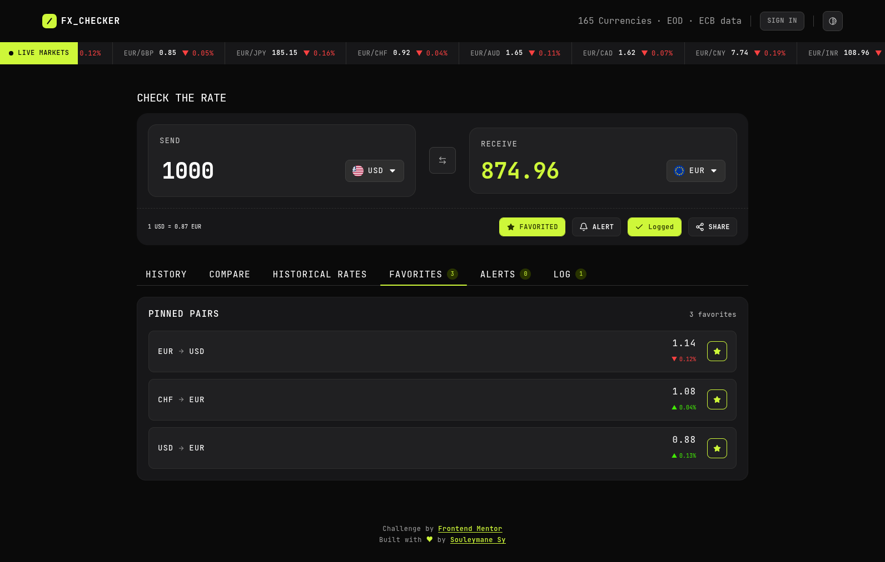
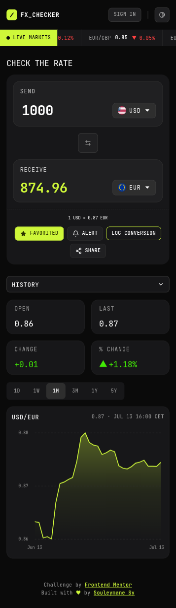
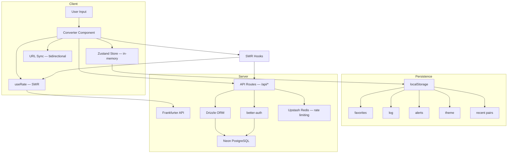

# FX Checker — Foreign Exchange Currency Converter


**FM30 Hackathon** · Frontend Mentor · June 12 – July 13, 2026

**FX Checker** is a full-stack currency converter built for the [Frontend Mentor FM30 Hackathon](https://www.frontendmentor.io/challenges/foreign-exchange-currency-converter). It pulls live rates from the European Central Bank via the Frankfurter API (free, no API key, no rate limits) and presents them through a converter, historical charts, multi-currency comparison, pinned favorites, rate alerts, and a conversion log. User accounts sync favorites, logs, and alerts across devices via [Neon PostgreSQL](https://neon.tech/).

**Live demo:** [https://fem-fx-checker-hackaton.vercel.app/](https://fem-fx-checker-hackaton.vercel.app/)

**Solution page:** [https://www.frontendmentor.io/solutions/fx-checker-full-stack-foreign-exchange-currency-converter](https://www.frontendmentor.io/solutions/fx-checker-full-stack-foreign-exchange-currency-converter-j_Nsyg0Emv)

**WakaTime (coding time):** [](https://wakatime.com/badge/user/018cb534-87bb-4814-975b-ca5e3cb8572b/project/3744af2b-53c9-404d-b9c4-ac6165f9e277)

---

## Table of Contents

- [Project Status](#project-status)
- [Screenshots](#screenshots)
- [Features](#features)
- [Design System](#design-system)
- [Tech Stack](#tech-stack)
- [Architecture](#architecture)
- [API Reference](#api-reference)
- [Getting Started](#getting-started)
- [Folder Structure](#folder-structure)
- [Known Limitations](#known-limitations)
- [Difficulties & Future Work](#difficulties--future-work)
- [Security](#security)
- [Performance](#performance)
- [Judging Criteria](#judging-criteria)
- [Stretch Goals](#stretch-goals)
- [Deployment](#deployment)
- [Author](#author)

---

## Project Status

Six phases between now and **July 13, 2026 at 14:00 BST**. Results on July 16. Commit history tracks progress in more detail than this table does.

| Phase                       | Scope                                                               | Status |
| --------------------------- | ------------------------------------------------------------------- | ------ |
| 1 — Scaffolding             | Repo setup, routing, design tokens, Zustand slices, SWR wrappers    | Done   |
| 2 — Converter               | Currency picker, amount input, swap, live rate display              | Done   |
| 3 — Markets & History       | Ticker, rate chart, time-range selector                             | Done   |
| 4 — Compare, Favorites, Log | Compare table, pin system, conversion log, localStorage persistence | Done   |
| 5 — Polish                  | Animations (Framer Motion), responsive pass, accessibility audit    | Done   |
| 6 — Deploy                  | Vercel deployment, full-stack wiring, hackathon submission          | Done   |

_Last updated: July 2026 — All phases complete_

---

## Screenshots







---

## Features

### Converter

- Type an amount and see the converted value update in real time (300ms debounce)
- Pick currencies from a searchable picker (flag, code, name) grouped into Popular and Other
- Swap send/receive currencies in one click
- Live rate displayed for the active pair (e.g. `1 USD = 0.8530 EUR`)
- Log a conversion or pin the active pair directly from the converter
- Bidirectional URL sync for shareable conversion links (`/convert?from=USD&to=EUR&amount=100`)
- Recent pairs tracked automatically (MRU, max 8) and shown at the top of the picker

### Live Markets

- Scrolling ticker showing current rates and 24h change for a set of pairs
- Rate history chart for the active pair with range selector: 1D / 1W / 1M / 3M / 1Y / 5Y
- Open, last, absolute change, and percentage change shown per selected range

### Compare

- Convert a send amount into multiple currencies at once, side by side
- Pin or unpin any row directly from the comparison table
- Top gainer/loser highlighted
- Toggle to a multi-line chart view for trend comparison

### Favorites

- Pinned pairs with live rates and 24h change
- Click any row to load that pair into the converter
- Persisted in `localStorage` with server sync when signed in

### Rate Alerts

- Set rate alerts with a target threshold and condition (above / below)
- Background watcher polls latest rates and fires toast notifications when thresholds are crossed
- Manage alerts: reset triggered alerts, delete individual alerts, or clear all

### Historical Rates

- Time Machine: pick any date (back to 1999) and see the rate for the active pair
- Compare historical rate vs current rate with absolute and percentage change
- Handles weekend/holiday rate snapping automatically

### Conversion Log

- Auto-logged on each conversion: relative time, pair, send and receive amounts
- Delete individual entries or clear the full log
- Capped at 100 entries (FIFO)
- CSV export
- Persisted in `localStorage` with server sync when signed in

### Keyboard Shortcuts

- `Ctrl+K` — Focus the currency search
- `Ctrl+S` — Swap send/receive currencies
- `Alt+1` to `Alt+6` — Switch chart time range
- `?` — Open keyboard shortcuts help panel

### Share

- Native share API on supported devices (mobile)
- Clipboard fallback with toast confirmation on desktop

### Auth & Account Sync

- Sign in / sign up with email and password (Zod-validated forms)
- When signed in, favorites, logs, and alerts sync between localStorage and the server
- Sign out returns to local-only mode with no data loss

### Theme Toggle

- Dark theme (default) and light theme
- Toggle via the header button, preference persisted in `localStorage`
- FOUC prevented by an inline initialization script in the root layout

### Accessibility

- Fully responsive: mobile, tablet, desktop
- Keyboard-navigable throughout
- Visible focus and hover states on every interactive element (`focus-ring` utility)
- Empty states for favorites, log, comparison, alerts, and chart errors. No silent blank panels.
- Screen reader text for the ticker marquee and theme toggle
- Splash screen with loading state until all initial data is ready

---

## Design System

Two themes (dark + light). One font. Semantic color tokens. Responsive sizing via `clamp()`. The token list below is the source of truth and lives in `tokens.css` and `shadcn.css`.

### Themes

| Theme | Default | Accent       | Background              | Toggle                   |
| ----- | ------- | ------------ | ----------------------- | ------------------------ |
| Dark  | Yes     | Lime (green) | `--neutral-900`         | Header button, persisted |
| Light | No      | Violet       | `--neutral-900` (light) | Header button, persisted |

Dark theme uses lime on near-black. Light theme uses violet on near-white. Both share the same neutral scale (inverted per theme), spacing, and typography. The active theme is applied via a `.dark` / `.light` class on `<html>`, synced by the `ThemeToggle` component and initialized inline to prevent FOUC.

### Colors

```css
:root {
  /* ── Neutrals (dark theme) ─────────────────────────────── */
  --neutral-900: oklch(0.1448 0 0); /* page background */
  --neutral-700: oklch(0.2055 0.0039 286.05);
  --neutral-600: oklch(0.2443 0.0038 286.12);
  --neutral-500: oklch(0.3012 0 0);
  --neutral-400: oklch(0.36 0 0);
  --neutral-300: oklch(0.3911 0.0033 286.24);
  --neutral-200: oklch(0.696 0 0);
  --neutral-100: oklch(0.8266 0 0);
  --neutral-50: oklch(1 0 0); /* primary text */

  /* ── Primary (dark theme) ──────────────────────────────── */
  --primary: oklch(0.9157 0.2054 121.64); /* lime — text, icons, rings */
  --primary-accent: oklch(
    0.3 0.0726 121.83
  ); /* dark lime — backgrounds, hover */

  /* ── Semantic ──────────────────────────────────────────── */
  --green: oklch(0.8217 0.267 140.6); /* positive change */
  --red: oklch(0.6607 0.2258 25.95); /* negative change */
}

.light {
  /* ── Neutrals (light theme — inverted scale) ──────────── */
  --neutral-900: oklch(0.96 0.0054 297.72); /* page background */
  --neutral-700: oklch(0.9851 0 0);
  --neutral-600: oklch(0.9702 0 0);
  --neutral-500: oklch(0.9219 0 0);
  --neutral-400: oklch(0.8699 0 0);
  --neutral-300: oklch(0.7155 0 0);
  --neutral-200: oklch(0.5555 0 0);
  --neutral-100: oklch(0.2686 0 0);
  --neutral-50: oklch(0.1448 0 0); /* now dark — primary text */

  /* ── Primary (light theme) ────────────────────────────── */
  --primary: oklch(0.5718 0.2285 284.18); /* violet */
  --primary-accent: oklch(0.8943 0.0549 293.28); /* light violet */

  /* ── Semantic ──────────────────────────────────────────── */
  --green: oklch(0.5273 0.1371 150.07);
  --red: oklch(0.5054 0.1905 27.52);
}
```

Design tokens are mapped to shadcn CSS variables (`--background`, `--card`, `--popover`, `--muted`, `--accent`, `--destructive`, `--border`, `--ring`, `--chart-1` to `--chart-5`, `--sidebar-*`) so shadcn/ui components respect both themes automatically.

### Typography

Single font: **JetBrains Mono** (weights: 400 / 500 / 700). Presets 1 and 3 use `clamp()` for responsive sizing.

| Preset        | Size                                          | Line height | Letter spacing | Weight  |
| ------------- | --------------------------------------------- | ----------- | -------------- | ------- |
| Preset 1      | `clamp(2rem, 1.8261rem + 0.8696vw, 2.5rem)`   | 100%        | -0.5px         | Bold    |
| Preset 2      | 20px                                          | 120%        | -0.5px         | Regular |
| Preset 2 Bold | 20px                                          | 140%        | -0.5px         | Bold    |
| Preset 3      | `clamp(0.875rem, 0.8315rem + 0.2174vw, 1rem)` | 120%        | 1px            | Regular |
| Preset 3 Med  | 16px                                          | 120%        | 1px            | Medium  |
| Preset 3 Bold | 16px                                          | 110%        | 1px            | Bold    |
| Preset 4      | 14px                                          | 120%        | 1px            | Regular |
| Preset 5      | 12px                                          | 120%        | 0.5px          | Regular |
| Preset 5 Med  | 12px                                          | 130%        | 0.5px          | Medium  |
| Preset 6      | 10px                                          | 100%        | 0px            | Regular |

### Spacing

Base unit: 8px (`step-100`). Larger tokens use `clamp()` for responsive spacing. In Tailwind, use the `step-*` prefix: `p-step-200`, `gap-step-300`, `my-step-400`.

| Token    | Value                                            | Token     | Value                                        |
| -------- | ------------------------------------------------ | --------- | -------------------------------------------- |
| step-025 | 2px                                              | step-600  | `clamp(2.75rem, 2.663rem + 0.4348vw, 3rem)`  |
| step-050 | 4px                                              | step-800  | `clamp(3.5rem, 3.3261rem + 0.8696vw, 4rem)`  |
| step-075 | 6px                                              | step-1000 | `clamp(4.5rem, 4.3261rem + 0.8696vw, 5rem)`  |
| step-100 | 8px                                              | step-1200 | `clamp(5rem, 4.6522rem + 1.7391vw, 6rem)`    |
| step-125 | 10px                                             | step-1400 | `clamp(6rem, 5.6522rem + 1.7391vw, 7rem)`    |
| step-150 | 12px                                             | step-1600 | `clamp(7rem, 6.6522rem + 1.7391vw, 8rem)`    |
| step-200 | 16px                                             | step-1800 | `clamp(8rem, 7.7391rem + 1.3043vw, 8.75rem)` |
| step-250 | `clamp(1.125rem, 1.0815rem + 0.2174vw, 1.25rem)` |
| step-300 | `clamp(1.375rem, 1.3315rem + 0.2174vw, 1.5rem)`  |
| step-400 | `clamp(1.75rem, 1.663rem + 0.4348vw, 2rem)`      |
| step-500 | `clamp(2.25rem, 2.163rem + 0.4348vw, 2.5rem)`    |

### Containers

Three fixed-width breakpoints for consistent layout bounds:

| Token                 | Value    | Usage             |
| --------------------- | -------- | ----------------- |
| `--container-small`   | 68.75rem | Main content area |
| `--container-large`   | 90rem    | Header            |
| `--container-x-large` | 100rem   | Ticker            |

### Border Radius

| Token       | Value |
| ----------- | ----- |
| radius-0    | 0px   |
| radius-4    | 4px   |
| radius-6    | 6px   |
| radius-8    | 8px   |
| radius-10   | 10px  |
| radius-12   | 12px  |
| radius-16   | 16px  |
| radius-20   | 20px  |
| radius-24   | 24px  |
| radius-full | 999px |

### Chart Colors

Eight per-currency colors for the compare chart, with separate dark and light variants:

| Token            | Dark                   | Light                  |
| ---------------- | ---------------------- | ---------------------- |
| `--currency-gbp` | `oklch(0.68 0.18 250)` | `oklch(0.48 0.17 250)` |
| `--currency-jpy` | `oklch(0.7 0.21 20)`   | `oklch(0.55 0.19 20)`  |
| `--currency-chf` | `oklch(0.72 0.19 320)` | `oklch(0.52 0.18 320)` |
| `--currency-cad` | `oklch(0.8 0.15 100)`  | `oklch(0.58 0.14 100)` |
| `--currency-aud` | `oklch(0.75 0.13 195)` | `oklch(0.55 0.13 195)` |
| `--currency-inr` | `oklch(0.78 0.17 45)`  | `oklch(0.6 0.16 45)`   |
| `--currency-cny` | `oklch(0.82 0.16 70)`  | `oklch(0.62 0.15 70)`  |
| `--currency-bdt` | `oklch(0.78 0.15 145)` | `oklch(0.55 0.15 145)` |

---

## Tech Stack

| Layer          | Choice                                          |
| -------------- | ----------------------------------------------- |
| Framework      | Next.js 16 (App Router) + React 19              |
| React Compiler | babel-plugin-react-compiler                     |
| Language       | TypeScript                                      |
| Styling        | Tailwind CSS v4                                 |
| UI primitives  | shadcn/ui (Radix-based)                         |
| CSS helpers    | class-variance-authority, tailwind-merge, clsx  |
| State          | Zustand with `persist` middleware               |
| Data fetching  | SWR — caching, deduplication, auto-revalidation |
| HTTP client    | Axios                                           |
| Database       | Drizzle ORM + Neon PostgreSQL                   |
| Auth           | better-auth                                     |
| Rate limiting  | Upstash Redis + @upstash/ratelimit              |
| Charts         | Recharts                                        |
| Animation      | Framer Motion                                   |
| Validation     | Zod + drizzle-zod                               |
| Icons          | Lucide React                                    |
| Utilities      | date-fns, next-themes, sonner                   |
| Linting        | Biome                                           |
| Font           | JetBrains Mono                                  |

---

## Architecture



Data flows in two directions:

1. **Read path**: SWR hooks fetch from Frankfurter (rates) or `/api/*` (favorites, logs, alerts), cache results, and auto-revalidate. Components consume hooks directly.
2. **Write path**: User actions (pin, log, alert) go through mutation hooks, then `/api/*` routes, then Drizzle, then Neon. The same mutations also update localStorage for instant offline access. When signed in, `AccountSync` reconciles localStorage with the database.

---

## API Reference

### External — Frankfurter

All exchange rates come from [Frankfurter](https://frankfurter.dev/), a free, CORS-enabled API with no API key required. Rates are blended across 84 central banks for 201 currencies.

| Endpoint                                         | Used for                |
| ------------------------------------------------ | ----------------------- |
| `GET /currencies`                                | Currency picker list    |
| `GET /rate/{base}/{quote}`                       | Converter (single pair) |
| `GET /rates?base=USD&quotes=EUR,GBP`             | Ticker, comparison      |
| `GET /rates?base=USD&quotes=EUR&from=...&to=...` | Rate history chart      |

There's no separate "latest" or date-range path. One `/rates` endpoint covers the latest rate, a specific date (`date=`), and a time series (`from`/`to`), differentiated by query params. `quotes` is the equivalent of what other FX APIs call `symbols`.

The base URL (already includes `/v2`) is set via environment variable:

```
NEXT_PUBLIC_EXCHANGE_API_BASE=https://api.frankfurter.dev/v2
```

### Internal — Application API

| Route            | Methods                          | Purpose                               |
| ---------------- | -------------------------------- | ------------------------------------- |
| `/api/favorites` | `GET`, `POST`, `DELETE`          | CRUD for pinned currency pairs        |
| `/api/logs`      | `GET`, `POST`, `DELETE`          | CRUD for conversion log entries       |
| `/api/alerts`    | `GET`, `POST`, `PATCH`, `DELETE` | CRUD for rate alerts                  |
| `/api/auth/*`    | `POST`                           | better-auth sign-in, sign-up, session |

All write endpoints are rate-limited via Upstash Redis.

---

## Getting Started

### Prerequisites

- [Bun](https://bun.sh/) (or npm / yarn / pnpm)
- A [Neon](https://neon.tech/) PostgreSQL database (free tier works)
- An [Upstash](https://upstash.com/) Redis instance (free tier works)

### 1. Clone and install

```bash
git clone https://github.com/SouleymaneSy7/fem-fx-checker-hackaton.git
cd fem-fx-checker-hackaton

bun install
```

### 2. Environment variables

Copy the example and fill in your values:

```bash
cp env.example .env.local
```

| Variable                        | Required | Description                                 |
| ------------------------------- | -------- | ------------------------------------------- |
| `NEXT_PUBLIC_EXCHANGE_API_BASE` | Yes      | Frankfurter API base URL                    |
| `DATABASE_URL`                  | Yes      | Neon PostgreSQL connection string           |
| `BETTER_AUTH_SECRET`            | Yes      | Auth secret (min 32 chars)                  |
| `BETTER_AUTH_URL`               | Yes      | App base URL (e.g. `http://localhost:3000`) |
| `UPSTASH_REDIS_REST_URL`        | Yes      | Upstash Redis REST URL                      |
| `UPSTASH_REDIS_REST_TOKEN`      | Yes      | Upstash Redis REST token                    |

### 3. Database setup

```bash
bun run db:generate    # generate Drizzle migration
bun run db:push        # push schema to Neon
bun run db:studio      # optional — open Drizzle Studio
```

### 4. Run the dev server

```bash
bun dev
```

Open [http://localhost:3000](http://localhost:3000).

### 5. Lint and format

```bash
bun run lint      # biome check
bun run format    # biome format --write
```

---

## Folder Structure

```
src/
├── app/                          # Next.js App Router
│   ├── api/                      # Server-side API routes
│   │   ├── alerts/               #   Rate alerts CRUD
│   │   ├── auth/                 #   better-auth endpoints
│   │   ├── favorites/            #   Pinned pairs CRUD
│   │   └── logs/                 #   Conversion log CRUD
│   ├── layout.tsx                # Root layout (metadata, providers, theme init)
│   └── page.tsx                  # Main page
│
├── components/
│   ├── common/                   # Generic reusable components (Container, Title, etc.)
│   ├── features/                 # Components organized by business feature
│   │   ├── alerts/               #   Rate alerts panel + watcher
│   │   ├── auth/                 #   Sign-in / sign-up forms
│   │   ├── compare/              #   Multi-currency comparison + chart
│   │   ├── converter/            #   Core converter UI + URL sync
│   │   ├── favorites/            #   Pinned pairs panel
│   │   ├── historical-rates/     #   Time Machine — date picker + comparison
│   │   ├── log/                  #   Conversion history
│   │   ├── markets/              #   Ticker, rate chart, range selector
│   │   └── ticker/               #   Scrolling market ticker
│   ├── icons/                    # Custom SVG icon components
│   ├── layout/                   # Header, Footer, Navbar, TabNav, ThemeToggle
│   ├── loaders/                  # Splash screen, LiquidWave, SpinnerEllipsis
│   ├── providers/                # SWRProvider
│   ├── shared/                   # Components reused across features (CurrencyPicker, etc.)
│   └── ui/                       # shadcn/ui primitives (Button, Tabs, Tooltip, etc.)
│
├── constants/                    # App-wide constants (API, ranges, timing, shortcuts, etc.)
├── db/                           # Database layer
│   ├── index.ts                  #   Drizzle client
│   ├── schema.ts                 #   Combined schema barrel
│   ├── migrations/               #   Auto-generated SQL migrations
│   └── schemas/                  #   Per-feature schema definitions
├── hooks/                        # Custom React hooks (23 hooks)
├── lib/                          # Auth client, rate limiting, Redis, utilities
├── services/                     # API layer — Frankfurter + internal routes
├── store/                        # Zustand stores (converter, favorites, log, alerts, theme, recent pairs)
├── style/                        # CSS architecture
│   ├── globals.css               #   Entry point — imports all CSS
│   ├── tokens.css                #   Design tokens (colors, spacing, typography)
│   ├── shadcn.css                #   shadcn semantic variable mapping
│   ├── tailwind-config.css       #   Tailwind v4 @theme configuration
│   └── utilities.css             #   Custom utilities and animations
├── types/                        # Centralized TypeScript declarations
├── utils/                        # Pure utilities (formatting, export, storage, etc.)
└── validators/                   # Zod schemas for API + form validation
```

---

## Known Limitations

**No intraday data from Frankfurter.** Most providers behind the API publish rates once per business day. The 1D chart range shows a single data point, not an intraday curve. Every other range (1W and above) works fine. A paid API with tick data would fix this, but it's out of scope for this hackathon.

**No test suite.** Zero unit or integration tests right now. The codebase relies on TypeScript strict mode, Biome linting, and Zod runtime validation. Automated tests would help with edge cases and regressions.

---

## Difficulties & Future Work

### What was challenging

- **Intraday data limitation**: The Frankfurter API publishes rates once per business day. The 1D chart only gets a single data point, so I had to design around that with loading states and clear messaging instead of building a real intraday curve.
- **Bidirectional URL sync**: Keeping the converter state in sync with URL search params, and handling collisions when `from === to`, took more iteration than expected. The `converter-url-sync` hook had to be SSR-safe and debounce writes to avoid navigation thrash.
- **Full-stack state reconciliation**: Merging localStorage (instant, offline) with server state (persistent, shared) introduced edge cases around ordering, conflict resolution, and what happens when the user signs in mid-session.
- **Theme FOUC**: Preventing a flash of unstyled content on first paint required an inline `<script>` in the root layout that runs before React hydrates. The `ThemeToggle` component then takes over post-mount.
- **Rate alert polling**: Running a background polling loop for alerts without blocking renders or leaking intervals meant careful cleanup in the `AlertsWatcher` component.

### What I'd like to work on next

- **Testing**: Vitest for unit tests (hooks, utils, validators) and Playwright for E2E flows (converter, auth, alerts). This is the biggest gap in the project.
- **Offline fallback**: Cache the last successful rates in a service worker and show a stale-data banner when the API is unreachable.
- **Crosshair on the rate chart**: Show exact date and rate on hover for better readability.
- **Optimistic updates with rollback**: Mutation hooks track pending state but could use proper rollback on failure.
- **End-to-end type safety**: Explore tRPC or similar to stop manually aligning types between API routes and client hooks.

---

## Security

- All write endpoints (`/api/favorites`, `/api/logs`, `/api/alerts`) are rate-limited via Upstash Redis.
- Zod schemas validate every API request body and form input. Types are inferred directly from schemas, so there's no manual duplication.
- better-auth handles session management. Favorites, logs, and alerts are scoped to the authenticated user via foreign keys.
- `.env.local` is gitignored. The `env.example` template contains placeholders only. No secrets are committed.
- Frankfurter API is CORS-enabled. Internal API routes run on the same origin.

---

## Performance

- React Compiler is enabled via `babel-plugin-react-compiler` in `next.config.ts`, which handles memoization automatically.
- SWR caches rates for 5 minutes, currencies for 1 hour, and flags for 1 day. Deduplication prevents redundant fetches across components.
- Converter amount is debounced at 300ms to avoid excessive API calls during typing.
- The compare chart fetches data only when the user switches to the chart tab (via an `enabled` flag).
- `clamp()` in spacing and font-size tokens means fewer breakpoints and less CSS.
- `useAppReadiness` tracks all initial SWR requests and dismisses the splash only when data is loaded, preventing layout shift.

---

## Lighthouse Scores

Measured on [July 13, 2026](https://pagespeed.web.dev/analysis/https-fem-fx-checker-hackaton-vercel-app/xgzl3b2dvk?hl=fr&form_factor=mobile) via PageSpeed Insights (Lighthouse 13.4.0).


| Category       | Mobile | Desktop |
| -------------- | ------ | ------- |
| Performance    | 81     | 96      |
| Accessibility  | 98     | 99      |
| Best Practices | 100    | 100     |
| SEO            | 100    | 100     |

**Core Web Vitals (mobile, simulated Slow 4G):**

| Metric                         | Value |
| ------------------------------ | ----- |
| First Contentful Paint (FCP)   | 0.9 s |
| Largest Contentful Paint (LCP) | 4.7 s |
| Total Blocking Time (TBT)      | 80 ms |
| Cumulative Layout Shift (CLS)  | 0.002 |
| Speed Index (SI)               | 4.3 s |

The performance score is mainly dragged down by the LCP element render delay (1,450 ms). The converted amount re-renders after SWR hydration, which pushes the LCP back. Server-side rendering the initial rate or preloading the critical CSS chunk would help. Accessibility drops to 98/99 because of a heading order issue: the "SEND" label uses an `<h3>` without a preceding `<h2>`.

---

## Judging Criteria

The FM30 panel evaluates submissions on five points:

- **Code quality**: typed, readable, no shortcuts that will bite later
- **Requirements**: core features covered, edge cases handled, accessibility solid
- **README**: clear, honest, actually useful to someone cloning the repo
- **Commit history**: progression is visible, commits say something
- **Live demo + public repo**: both accessible at submission time

---

## Stretch Goals

Shipped:

- [x] Light theme toggle
- [x] URL persistence for shareable conversions (`/convert?from=USD&to=EUR&amount=100`)
- [x] Keyboard shortcuts (focus search, swap currencies, switch chart range)
- [x] CSV export of the conversion log
- [x] Rate alerts with background polling and toast notifications
- [x] Historical rates ("Time Machine" date picker, back to 1999)
- [x] User accounts with favorites/logs/alerts sync across devices
- [x] Share button (native share API + clipboard fallback)
- [x] Animated splash screen (LiquidWave spinner + text morph)
- [x] Tooltip system with smart truncation detection
- [x] Confirmation dialogs with Framer Motion animations
- [x] `prefers-reduced-motion` support
- [x] Interactive compare chart legend (toggle individual currency lines)
- [x] Tab badges with live counts
- [x] Responsive tab dropdown on mobile
- [x] Custom date picker (no library dependency)
- [x] SEO / OpenGraph metadata

Not yet:

- [ ] Crosshair on the rate chart (exact date + rate on hover)
- [ ] Offline fallback (service worker + stale-data banner)

---

## Deployment

Deployed on [Vercel](https://vercel.com/). The Next.js config is picked up without extra setup.

**Production environment variables:**

| Variable                        | Notes                                                                   |
| ------------------------------- | ----------------------------------------------------------------------- |
| `NEXT_PUBLIC_EXCHANGE_API_BASE` | `https://api.frankfurter.dev/v2`                                        |
| `DATABASE_URL`                  | Neon PostgreSQL connection string (pooler recommended)                  |
| `BETTER_AUTH_SECRET`            | Generate a new secret for production                                    |
| `BETTER_AUTH_URL`               | Your production URL (e.g. `https://fem-fx-checker-hackaton.vercel.app`) |
| `UPSTASH_REDIS_REST_URL`        | Upstash Redis REST URL                                                  |
| `UPSTASH_REDIS_REST_TOKEN`      | Upstash Redis REST token                                                |

**Live URL:** [https://fem-fx-checker-hackaton.vercel.app/](https://fem-fx-checker-hackaton.vercel.app/)

---

## Author

_**Souleymane Sy**_

- **Portfolio**: [terminal-portfolio-website](https://terminal-portfolio-website-xi.vercel.app/)
- **GitHub**: [@SouleymaneSy7](https://github.com/SouleymaneSy7)
- **Frontend Mentor**: [@SouleymaneSy7](https://www.frontendmentor.io/profile/SouleymaneSy7)
- **LinkedIn**: [souleymanesy7](https://linkedin.com/in/souleymanesy7)
- **Twitter / X**: [@SouleymaneSy43](https://twitter.com/Souleymanesy43)
